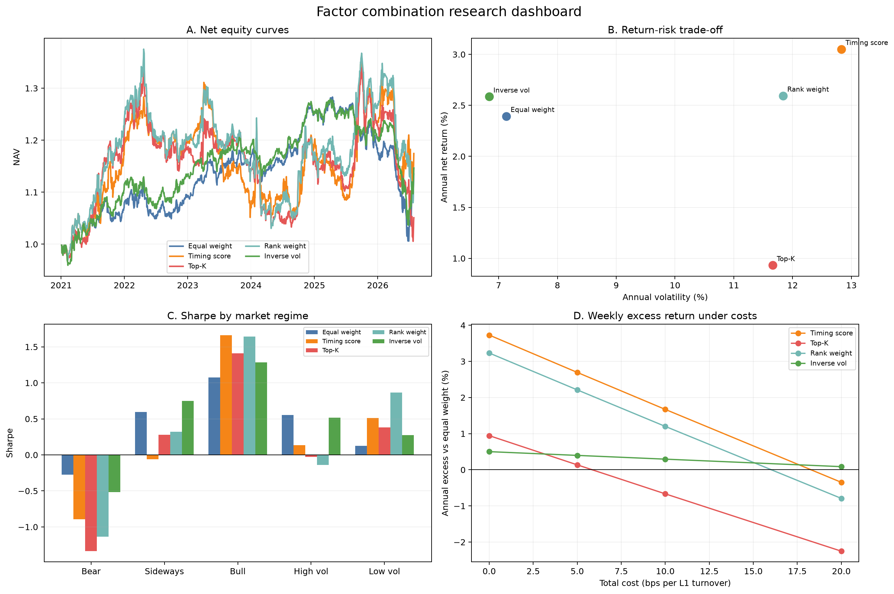

# 因子择时组合是否优于简单等权？——研究摘要

**样本：** 2021-01-04 至 2026-07-28，1,348 个交易日；**基准设定：** W-FRI 调仓，手续费 0.10%，滑点 0.05%，权重信号次日执行。

## 研究问题

在完全相同的因子收益、执行时点、成本模型和换手约束下，择时得分加权是否在收益、风险和统计意义上优于简单等权？如果优势并不普遍，它出现在哪些市场状态，哪类组合对交易成本更稳健？

## 方法与实验设计

比较等权、择时得分、Top-K、分位排名和逆波动五种只多因子组合。评价年化净收益、Sharpe、最大回撤、L1 换手和成本后超额；按牛/震荡/熊及高/低波动分层；进行 4 档成本 × 3 种调仓频率敏感性分析，并以 20 日移动区块 bootstrap 检验相对等权的日收益差。

## 核心结果

1. **全样本没有显著胜者。** 择时得分年化净收益 3.05%，略高于等权 2.39%，但 Sharpe 为 0.30，低于等权的 0.37。相对等权的 bootstrap 95% 区间为 [-8.77%, 12.44%]，跨过 0。

2. **择时收益具有明显状态依赖。** 牛市中择时得分年化收益 25.64%、Sharpe 1.66，高于等权的 6.10% 和 1.07；但熊市中等权亏损最小，择时得分年化收益为 -11.62%。

3. **高波动期复杂加权没有优势。** 高波动期等权 Sharpe 0.55 为最高；低波动期分位排名 Sharpe 0.86 为最高。震荡期逆波动 Sharpe 0.75 为最高。

4. **逆波动对成本最稳。** 基准成本下逆波动 Sharpe 0.41、最大回撤 -18.92%，优于等权的 0.37 和 -21.60%。周频总成本升至 20 bps 时，择时超额降至 -0.35%，逆波动仍为 0.09%。

5. **样本外证据不支持择时。** Walk-forward 拼接测试中择时年化收益约 -0.94%，等权约 1.13%；当前不能把全样本局部优势解释为稳定 Alpha。

## 结论

**择时得分不是等权的普遍替代品。** 它主要在牛市、低波动环境中有效，在熊市和高波动期会失效；更简单的逆波动配置虽然收益提升有限，但换手更低、对成本更稳健。所有动态策略相对等权的收益改善均未达到统计显著，因此最合理的研究判断是“存在状态依赖的描述性优势，但尚无稳健的样本外显著性”。

## 结论边界

回测使用当前沪深300成分股回看历史，存在幸存者偏差；只计因子组合层成本，未计底层股票换手与融券成本；样本约 5.5 年。下一步应优先补历史成分、真实财务因子和股票层成本，再延长样本做独立样本外检验，而不是继续扩大参数搜索。